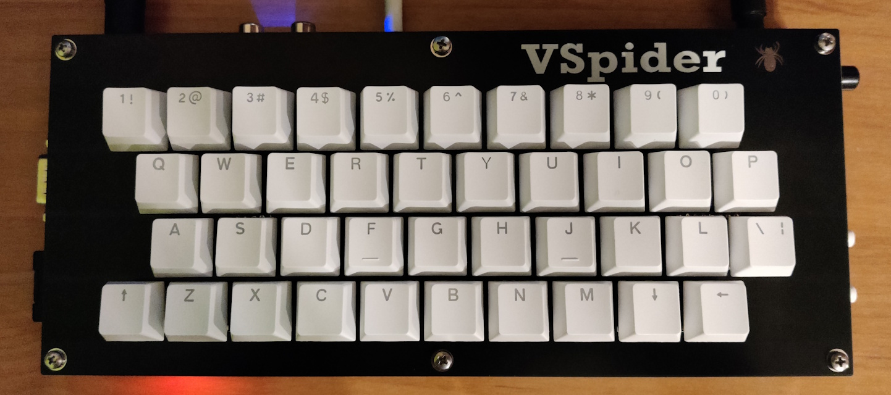
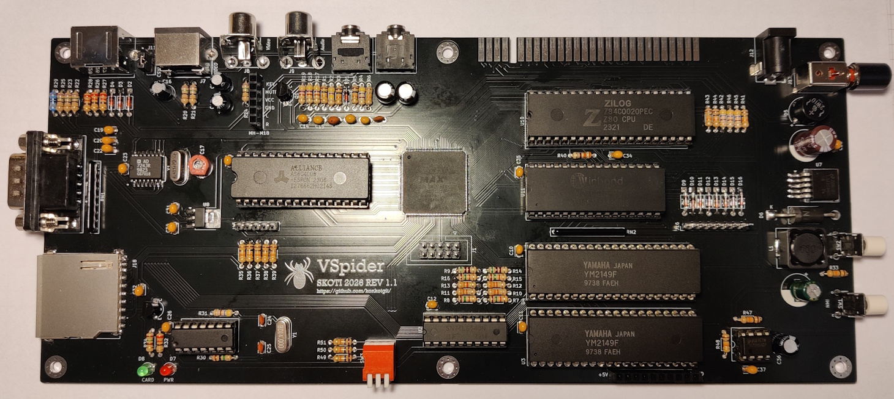

# 🕷️ VSpider  
### ZX Spectrum Pentagon Clone

A modern, through-hole friendly reimplementation of the classic **Pentagon** architecture — designed for reliability, expandability, and ease of assembly.

---

## 📸 Hardware Preview

  


---

## ⚙️ Hardware Features

- ULA implemented using **Altera CPLD (EPM3256)**
- **512 KB RAM**
- **128 KB ROM**
- Built-in **DivMMC**
- **Z-Controller** support
- **YM2149F TurboSound** (true stereo output)
- **Kempston-compatible** joystick interface
- **Bluetooth** audio module for game loading
- **WiFi Ready**

### 🎥 Video Outputs
- RGB (Mini-DIN/9, Sega-style)
- Composite
- S-Video

### 🔊 Audio & I/O
- EAR / MIC (tape interface)
- Line audio output

### 🔌 Power
- Input supports **either polarity** (protected)

### 🛠️ Build
- Fully optimized for **through-hole assembly**
- Ideal for DIY and retro enthusiasts

---

## 🧠 Operating Modes

| Mode | Description |
|:----:|-------------|
| 🟦 **A** | Pentagon 128 KB + DivMMC |
| 🟩 **B** | Pentagon 512 KB + GLUK Service + Z-Controller + TR-DOS (virtual 384 KB disk) |
| 🟥 **C** | Experimental ZX Spectrum +3 with MMC and +3e ROM |

---

## 🔧 CPLD Firmware Changelog

---

### 🟦 Mode A

- **Rev 1.2**  
  Added the ability to disable the built-in **TurboSound** for compatibility with external audio interfaces (middle switch).

- **Rev 1.1**  
  Added **Timex modes**.

- **Rev 1.0**  
  Initial revision.

---

### 🟩 Mode B

- **Rev 1.1**  
  Added the ability to disable the built-in **TurboSound** for compatibility with external audio interfaces (middle switch).

- **Rev 1.0**  
  Initial revision.

---

### 🟥 Mode C

- **Rev 1.1**  
  Added the ability to disable the built-in **TurboSound** for compatibility with external audio interfaces (middle switch).

- **Rev 1.0**  
  Initial revision of **ZX Spectrum +3 mode**.

---

## 💾 EPROM Layout

| Bank | Address Range | Content |
|:----:|:-------------:|:--------|
| 0 | 00000h – 03FFFh | esxDOS 0.8.9 |
| 1 | 04000h – 07FFFh | esxDOS 0.8.9 |
| 2 | 08000h – 0BFFFh | BASIC 128 |
| 3 | 0C000h – 0FFFFh | BASIC 48 |
| 4 | 10000h – 13FFFh | GLUK or FATALL |
| 5 | 14000h – 17FFFh | TR-DOS |
| 6 | 18000h – 1BFFFh | BASIC 128 |
| 7 | 1C000h – 1FFFFh | BASIC 48 |

---

# 🔧 Jumper & Switch Configuration

---

## 🔌 J11 — Video Mode Selection (CSYNC / Composite)

| Pins | Mode | Usage |
|:----:|:----:|------|
| **1–2** | Composite Sync | Use with **Mini-DIN/9 → Composite** cable |
| **2–3** | RGB Sync (CSYNC) | Use with **Mini-DIN/9 → SCART (Euro RGB)** cable |

👉 **Tip:**  
- Wrong setting = unstable or no picture  
- SCART users should almost always use **2–3**

---

## 🎛️ SW3 — Firmware Mode Switch

| Mode | 1 | 2 | 3 |
|:----:|:-----:|:-----:|:-----:|
| 🟦 **A** | Enables / disables **DivMMC** | TurboSound ON/OFF | — |
| 🟩 **B** | — | TurboSound ON/OFF | — |
| 🟥 **C** | Switch between **+3e / +3 ROM** | TurboSound ON/OFF | — |

👉 **Notes:**
- Switch **2 (middle)** controls **TurboSound enable/disable** in all modes  
- “—” means the switch position is **ignored**
- Other switches are reserved for future features

---

## ⚠️ Known Fixes & Notes

### 🎧 Tape Loading Issue (EAR)

If tape loading fails:

- Check transistor **Q1 (BC517)**

#### ⚠️ Critical Detail — Pinout Variants

Different manufacturers use different pin layouts:

**Variant A (standard):**
```
1 = Collector  
2 = Base  
3 = Emitter
```

**Variant B (reversed):**
```
1 = Emitter  
2 = Base  
3 = Collector
```

👉 **Fix:**  
- If using Variant B → rotate transistor **180°**

❗ Incorrect orientation = **tape loading will not work**

---

### 🧠 CPU Compatibility

It is recommended to use a **CMOS-based Z80 CPU**.  
NMOS variants may work, but compatibility is **not guaranteed**.

---

## 🎥 Demo Video

[](https://www.youtube.com/watch?v=_SU3fSY0keU)

---

## 🚀 Notes

- Designed for **retro compatibility + modern convenience**
- Ideal for:
  - Demo scene enthusiasts
  - Hardware hobbyists
  - ZX Spectrum collectors